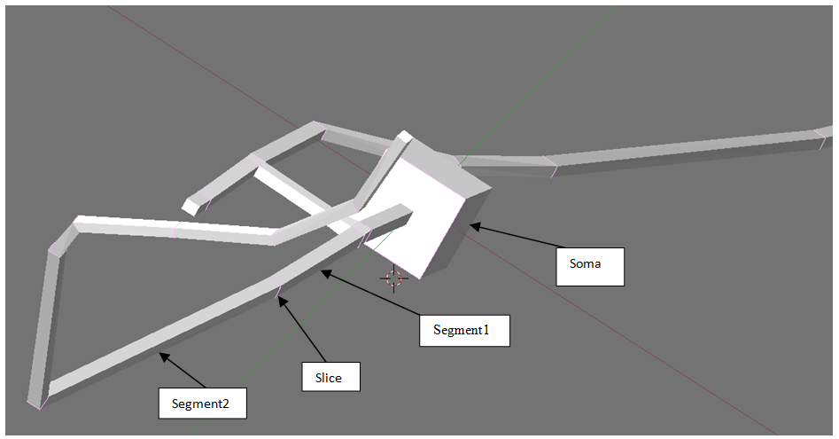
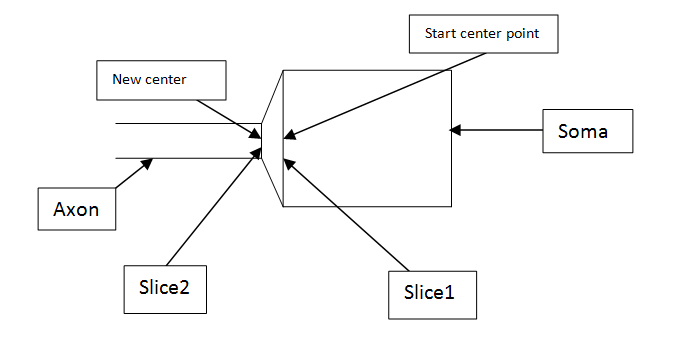
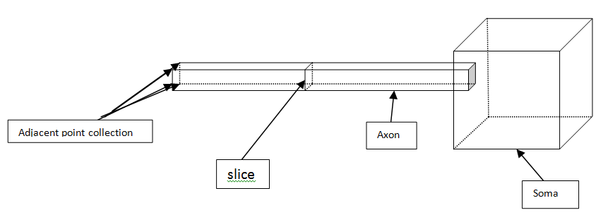
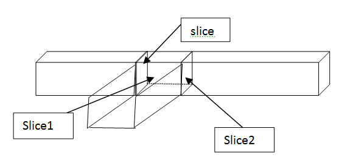
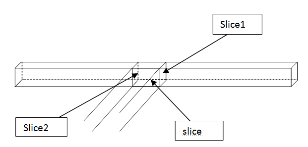
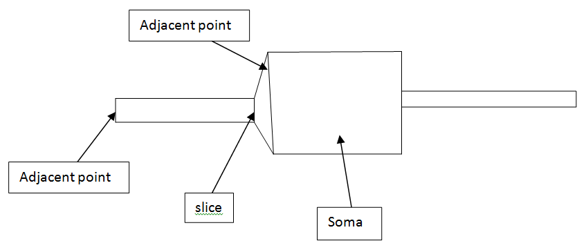

# How it Works

This is document extracted from [How it works.doc](./How%20it%20works.doc)

## Terminology

* **Vertex** – point with 3D coordinates (retrieved from `.wrl` or Blender file)
* **Vertices** – collection of vertex
* **Face** – a collection of 3, 4, or more vertices. It contains only indices of vertices from the `Vertices` collection (from `.wrl` or Blender)
* **Faces** – collection of face
* **Slice** – a collection of vertices located at the junction of two segments of an object. It is not a face.



* **Resulting\_point** – the center of mass of a slice

---

## 1. First Step of the Algorithm

We need to find the **start point**, which is a point located in the **soma**.

What soma is, in **Fig.1**, is obvious – it's the segment with the slice that has the **maximum perimeter**.



---

## 2. Algorithm for Finding All Resulting Points

* Add the current center point to the `resulting_points` collection.
* Fill up the `vector_len` collection, which contains objects with:

  * `index` of vertex from the `vertices` collection
  * `distance` from this point to the current center point

### Step 1

**Initialization:**

```text
iteration = 0
```

* Find, for the current center point, the **nearest slice** from `vector_len`.
* Calculate center point for the found slice.
* Put vertices of this slice into the `checked_points` collection.
* Set `current center point = new center point`
* Increment `iteration += 1`
* Recursively repeat with new center point.

---

### If `iteration != 0`, then:

#### Find next center point:

1. If `_slice = None`, initialize `slice` from `vector_len` collection.
2. Else (`_slice != None`) => `slice = _slice`
3. Find **adjacent points** for all points in the slice.

   * Adjacent points collection contains only those points **not** already in the `checked_points` collection.



---

### Adjacent Point Scenarios

#### a. 4 Points

* Simple segment without branching.
* Find slice from this 4-point collection, compute new center point.
* Update `current center point`, increment iteration.
* Add this slice's vertices to `checked_points`.
* Go to Step 1.

#### b. 6 Points

* If `isBrunchStart = false`: branching segment.

  * Two slices (**Slice1**, **Slice2**) found by analyzing adjacent points.

  * Compute center point for both slices.

  * Go to Step 1 for **each** new center point.

  * Add slice vertices to `checked_points`.



* If `isBrunchStart = true`: in first segment after branching.

  * Create slice from adjacent points, compute center point.
  * Update `current center point`
  * Add slice vertices to `checked_points`
  * Go to Step 1

#### c. 8 Points

* Try to find two slices (Slice1 and Slice2) from adjacent points.



* If 2 slices found:

  * Compute center point for each
  * Add their vertices to `checked_points`
  * Go to Step 1 for each

* If 0 slices found:

  * We are in the first point of **axon** or **dendrite**
  * Select the slice with the **smaller perimeter**
  * Compute new center point
  * Add vertices to `checked_points`
  * Go to Step 1 for new center point



---

## Step 2

If `iteration = 1`:

* Check if **Soma** has **other dendrites**.
* Check the **5 nearest slices** to the start center point.
* If such a slice is found, return to **Step 1** using the center point from that slice.

