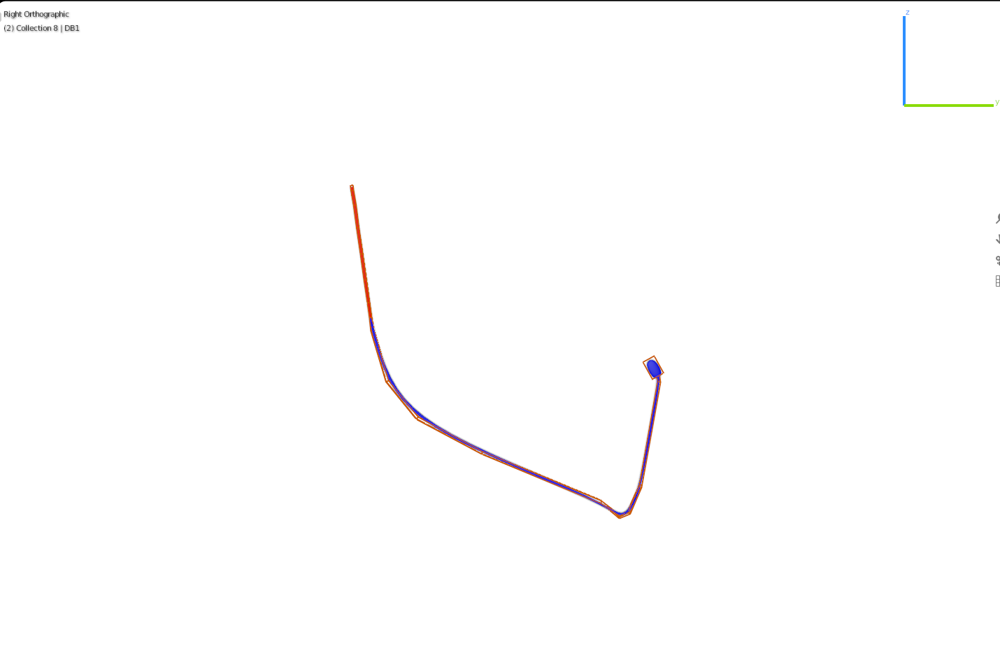
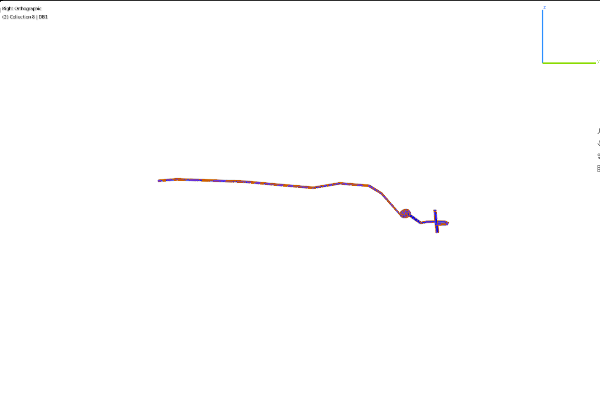

## Blender and NeuroML images

 [ADAL](#adal)  [RIFL](#rifl)  [IL1DR](#il1dr) 

### ADAL
<table border="0">
   <tr><td>Image generated from NeuroML file <a href="../Output/C.Elegans_ADAL.nml">C.Elegans_ADAL.nml</a></td>
   <td>Image generated from Blender</td></tr>
   <tr><td></td>
   <td>

   

   </td></tr>

</table>

### RIFL
<table border="0">
   <tr><td>Image generated from NeuroML file <a href="../Output/C.Elegans_RIFL.nml">C.Elegans_RIFL.nml</a></td>
   <td>Image generated from Blender</td></tr>
   <tr><td></td>
   <td>

   

   </td></tr>

</table>

### IL1DR
<table border="0">
   <tr><td>Image generated from NeuroML file <a href="../Output/C.Elegans_IL1DR.nml">C.Elegans_IL1DR.nml</a></td>
   <td>Image generated from Blender</td></tr>
   <tr><td></td>
   <td>

   

   </td></tr>

</table>

