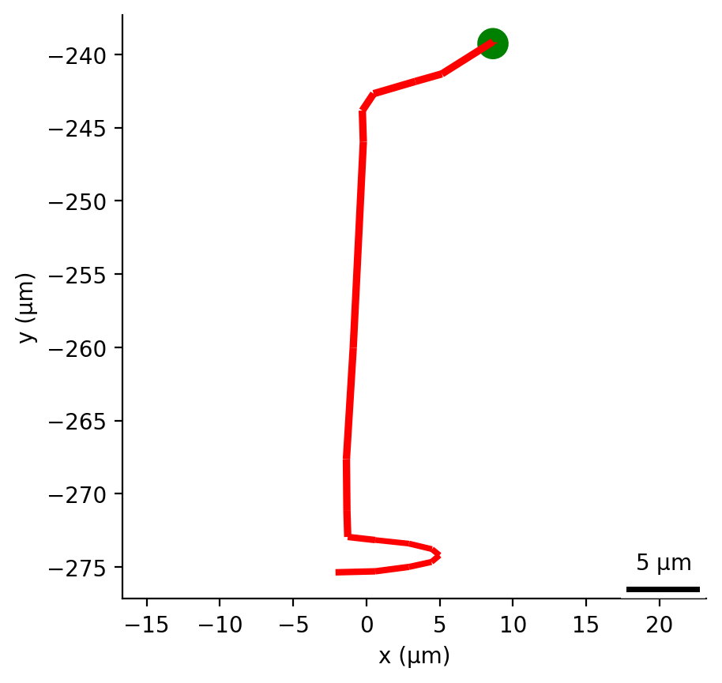
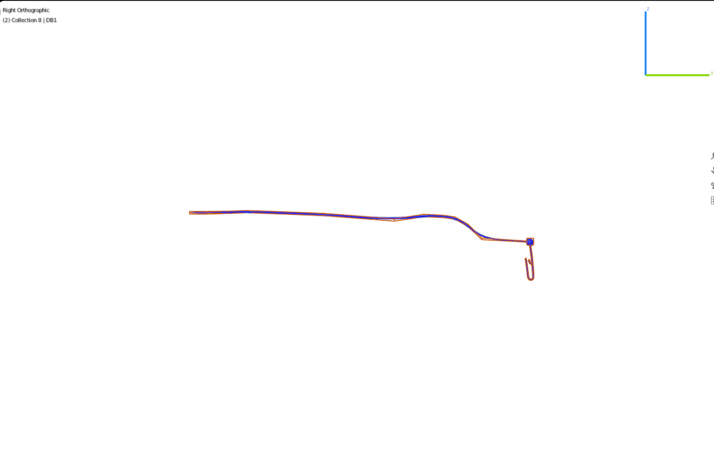
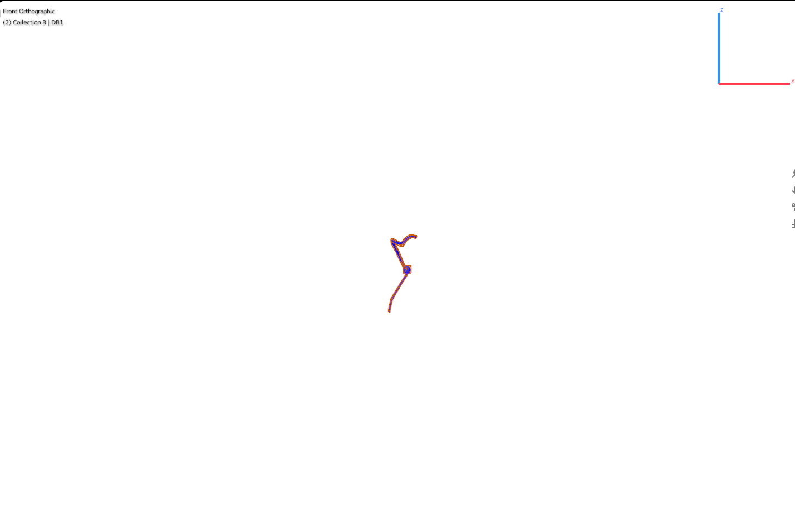
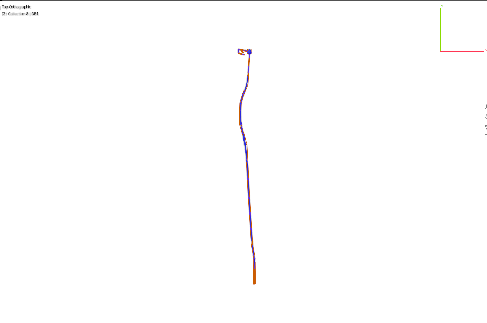
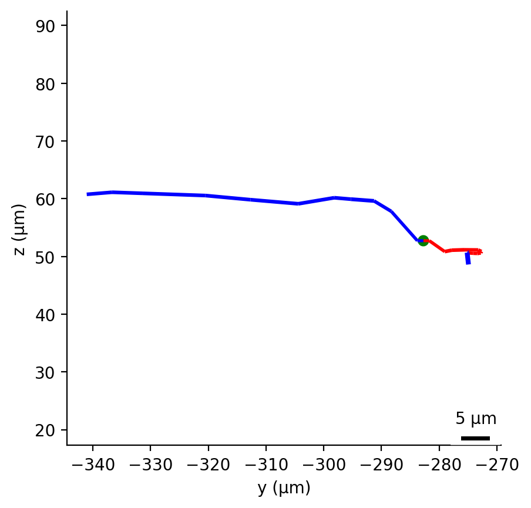
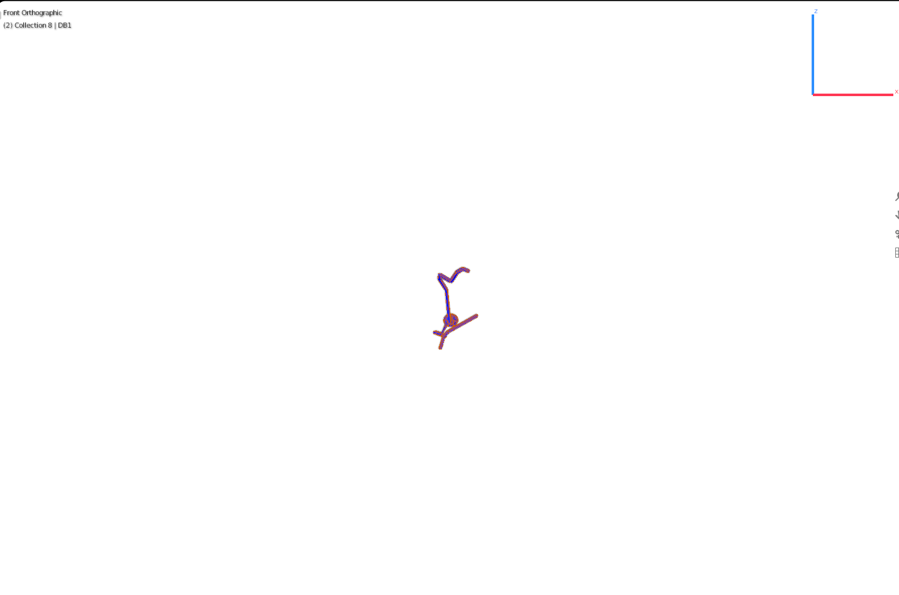
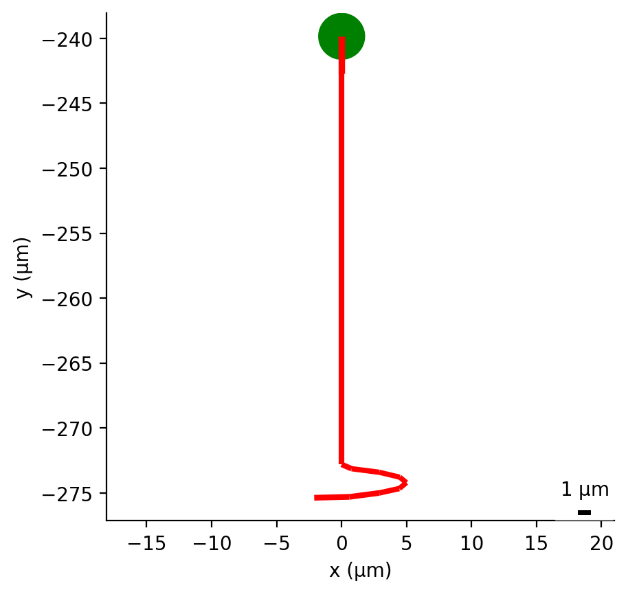
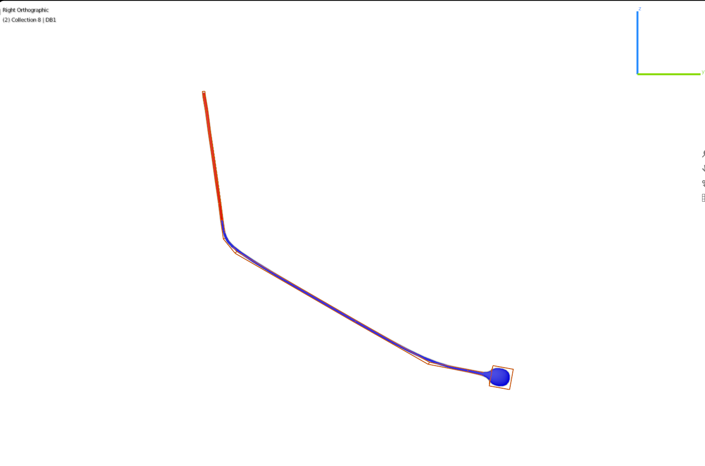
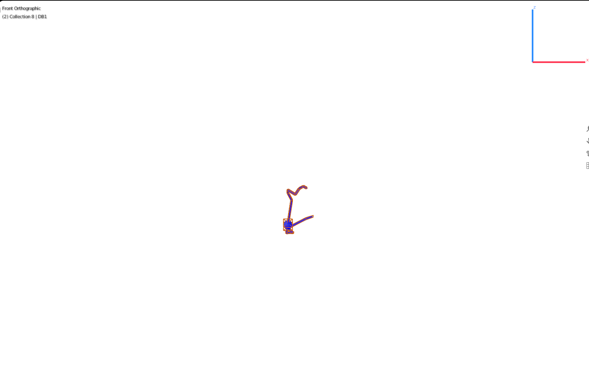

## Blender and NeuroML images

 [ADAL](#adal)  [AIZL](#aizl)  [CEPDR](#cepdr)  [DVC](#dvc)  [IL1DR](#il1dr)  [RIFL](#rifl)  [PVCR](#pvcr)  [SMBVR](#smbvr)  [URYDR](#urydr) 

### ADAL
<table border="0">
   <tr><td>Images generated from NeuroML file <a href="../Output/C.Elegans_ADAL.nml">C.Elegans_ADAL.nml</a></td>
   <td>Images generated from Blender</td></tr>
   <tr>
   <td>
       
       
       
   </td>

   <td> 
    
   </td></tr>

</table>

### AIZL
<table border="0">
   <tr><td>Images generated from NeuroML file <a href="../Output/C.Elegans_AIZL.nml">C.Elegans_AIZL.nml</a></td>
   <td>Images generated from Blender</td></tr>
   <tr>
   <td>
       
       
       
   </td>

   <td> 
    
   </td></tr>

</table>

### CEPDR
<table border="0">
   <tr><td>Images generated from NeuroML file <a href="../Output/C.Elegans_CEPDR.nml">C.Elegans_CEPDR.nml</a></td>
   <td>Images generated from Blender</td></tr>
   <tr>
   <td>
       
       
       
   </td>

   <td> 
    
   </td></tr>

</table>

### DVC
<table border="0">
   <tr><td>Images generated from NeuroML file <a href="../Output/C.Elegans_DVC.nml">C.Elegans_DVC.nml</a></td>
   <td>Images generated from Blender</td></tr>
   <tr>
   <td>
       
       
       
   </td>

   <td> 
    
   </td></tr>

</table>

### IL1DR
<table border="0">
   <tr><td>Images generated from NeuroML file <a href="../Output/C.Elegans_IL1DR.nml">C.Elegans_IL1DR.nml</a></td>
   <td>Images generated from Blender</td></tr>
   <tr>
   <td>
       
       
       
   </td>

   <td> 
    
   </td></tr>

</table>

### RIFL
<table border="0">
   <tr><td>Images generated from NeuroML file <a href="../Output/C.Elegans_RIFL.nml">C.Elegans_RIFL.nml</a></td>
   <td>Images generated from Blender</td></tr>
   <tr>
   <td>
       
       
       
   </td>

   <td> 
    
   </td></tr>

</table>

### PVCR
<table border="0">
   <tr><td>Images generated from NeuroML file <a href="../Output/C.Elegans_PVCR.nml">C.Elegans_PVCR.nml</a></td>
   <td>Images generated from Blender</td></tr>
   <tr>
   <td>
       
       
       
   </td>

   <td> 
    
   </td></tr>

</table>

### SMBVR
<table border="0">
   <tr><td>Images generated from NeuroML file <a href="../Output/C.Elegans_SMBVR.nml">C.Elegans_SMBVR.nml</a></td>
   <td>Images generated from Blender</td></tr>
   <tr>
   <td>
       
       
       
   </td>

   <td> 
    
   </td></tr>

</table>

### URYDR
<table border="0">
   <tr><td>Images generated from NeuroML file <a href="../Output/C.Elegans_URYDR.nml">C.Elegans_URYDR.nml</a></td>
   <td>Images generated from Blender</td></tr>
   <tr>
   <td>
       
       
       
   </td>

   <td> 
    
   </td></tr>

</table>

