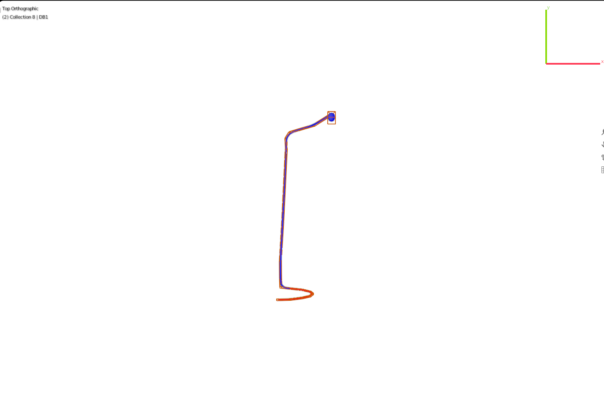
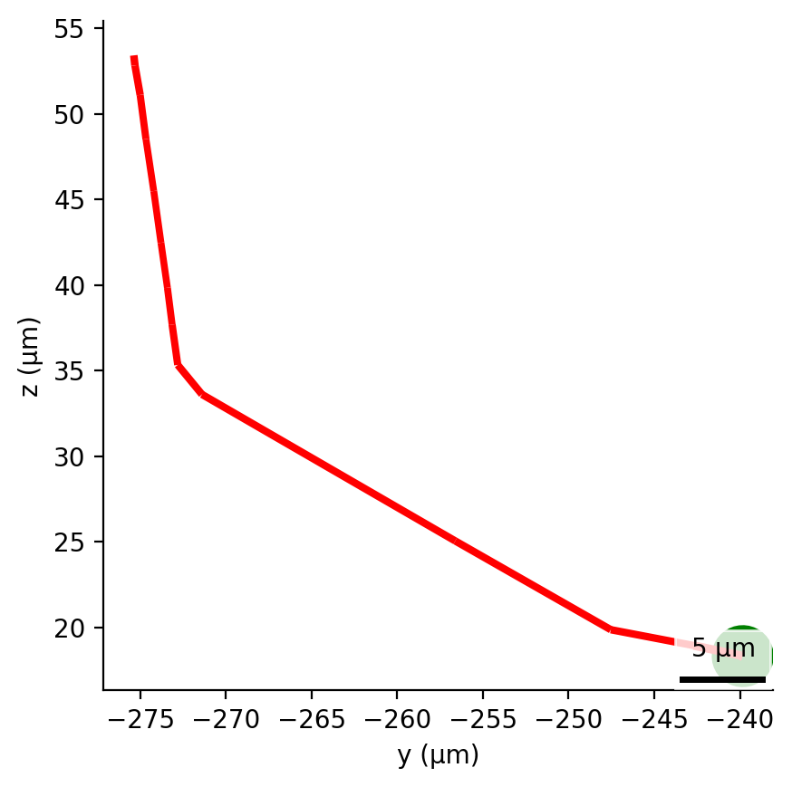
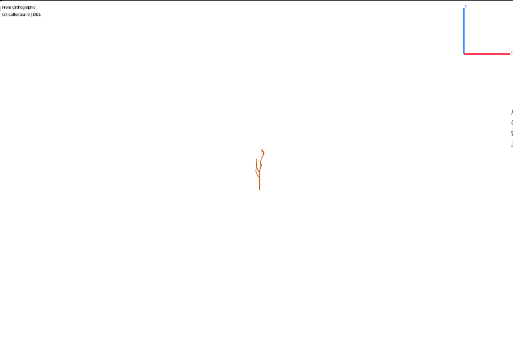
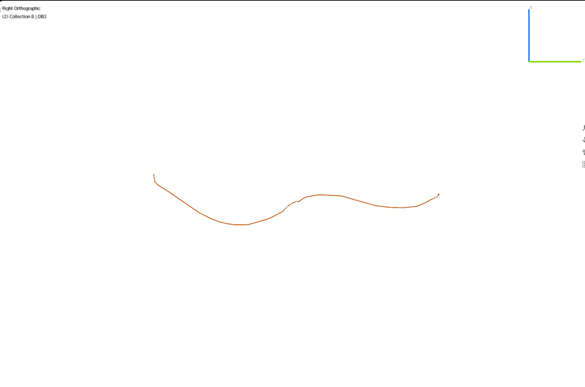

## Blender and NeuroML images

 [ADAL](#adal)  [RIFL](#rifl)  [IL1DR](#il1dr)  [SMBVR](#smbvr)  [PVCR](#pvcr) 

### ADAL
<table border="0">
   <tr><td>Images generated from NeuroML file <a href="../Output/C.Elegans_ADAL.nml">C.Elegans_ADAL.nml</a></td>
   <td>Images generated from Blender</td></tr>
   <tr>
   <td>
      
      
      
   </td>

   <td>
   
   </td></tr>

</table>

### RIFL
<table border="0">
   <tr><td>Images generated from NeuroML file <a href="../Output/C.Elegans_RIFL.nml">C.Elegans_RIFL.nml</a></td>
   <td>Images generated from Blender</td></tr>
   <tr>
   <td>
      
      
      
   </td>

   <td>
   
   </td></tr>

</table>

### IL1DR
<table border="0">
   <tr><td>Images generated from NeuroML file <a href="../Output/C.Elegans_IL1DR.nml">C.Elegans_IL1DR.nml</a></td>
   <td>Images generated from Blender</td></tr>
   <tr>
   <td>
      
      
      
   </td>

   <td>
   
   </td></tr>

</table>

### SMBVR
<table border="0">
   <tr><td>Images generated from NeuroML file <a href="../Output/C.Elegans_SMBVR.nml">C.Elegans_SMBVR.nml</a></td>
   <td>Images generated from Blender</td></tr>
   <tr>
   <td>
      
      
      
   </td>

   <td>
   
   </td></tr>

</table>

### PVCR
<table border="0">
   <tr><td>Images generated from NeuroML file <a href="../Output/C.Elegans_PVCR.nml">C.Elegans_PVCR.nml</a></td>
   <td>Images generated from Blender</td></tr>
   <tr>
   <td>
      
      
      
   </td>

   <td>
   
   </td></tr>

</table>

